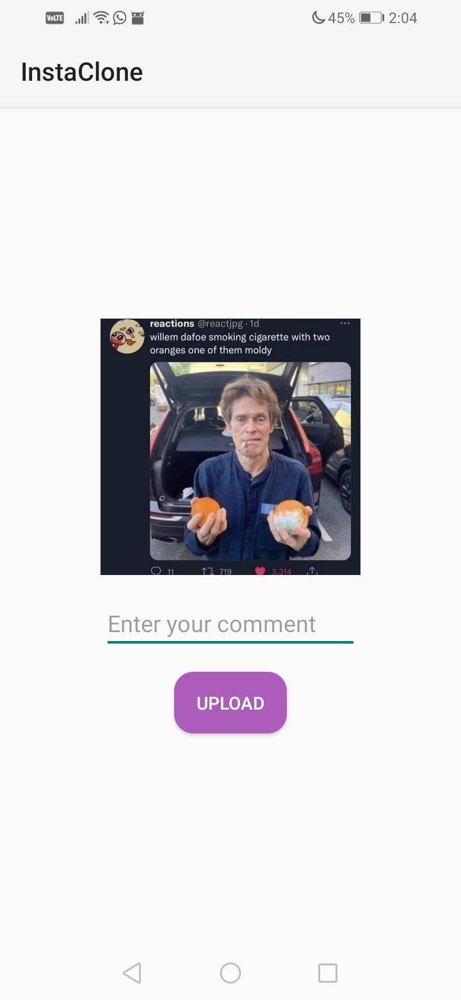

> I wrote this app for my Udemy course and not for practical purposes.

# Instagram Clone
An Instagram clone using Firebase. You can sign up, sign in and share posts. (Wow)

# Screenshots
| login                                        |
|----------------------------------------------|
| |

| add_post                                            | add_post2                                             |
|-----------------------------------------------------|-------------------------------------------------------|
|  |  |

| posts1                                          | posts2                                          |
|-------------------------------------------------|-------------------------------------------------|
|  |  |
